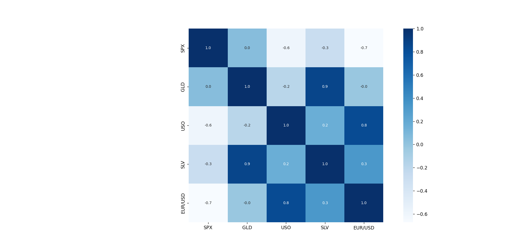

# Gold-Price-Prediction-ML
# 🏆 Gold Price Prediction using Machine Learning

A Machine Learning project that predicts Gold Prices (GLD) using historical financial market data such as S&P 500 Index (SPX), US Oil Prices (USO), Silver Prices (SLV), and EUR/USD exchange rates.

## 📌 Project Overview

Gold is one of the most important investment assets worldwide. Its price is influenced by various economic and market factors.

This project uses a **Random Forest Regressor** to analyze historical market data and predict Gold Prices with high accuracy.

## 🚀 Features

- Data Cleaning & Preprocessing
- Exploratory Data Analysis (EDA)
- Correlation Analysis
- Heatmap Visualization
- Gold Price Distribution Analysis
- Random Forest Regression Model
- Model Evaluation using R² Score
- Actual vs Predicted Price Comparison

## 📂 Dataset Information

| Feature | Description |
|----------|-------------|
| SPX | S&P 500 Index |
| USO | United States Oil Fund Price |
| SLV | Silver Price |
| EUR/USD | Euro to US Dollar Exchange Rate |
| GLD | Gold Price (Target Variable) |

Dataset Size: **2290 Records × 6 Columns**

## 🛠️ Technologies Used

- Python
- Pandas
- NumPy
- Matplotlib
- Seaborn
- Scikit-Learn

## 🤖 Machine Learning Model

Algorithm Used:

- Random Forest Regressor

## 📊 Model Performance

R² Score:

```text
0.98899
```

The model achieves approximately **98.9% prediction accuracy**, indicating excellent performance on the test dataset.

## 📈 Visualizations

### Correlation Heatmap


### Gold Price Distribution


### Actual vs Predicted Values

## 📁 Project Structure

```text
Gold-Price-Prediction-ML/
│
├── Car Price Prediction.py
├── gld_price_data.csv
├── Heatmap.png
├── count VS GLD.png
├── Actual vs Predicted Values.png
└── README.md
```

## ▶️ How to Run

1. Clone the repository

```bash
git clone https://github.com/allen745/Gold-Price-Prediction-ML.git
```

2. Install dependencies

```bash
pip install pandas numpy matplotlib seaborn scikit-learn
```

3. Run the project

```bash
python "Car Price Prediction.py"
```

## 📌 Results

- Strong correlation observed between Gold (GLD) and Silver (SLV).
- Random Forest Regressor successfully predicts Gold Prices.
- High R² score demonstrates strong predictive capability.

## 👨‍💻 Author

Allen Christian

GitHub: https://github.com/allen745
